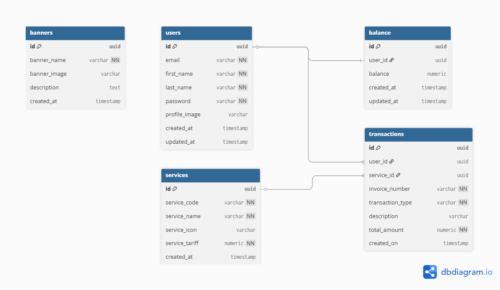

# SIMS PPOB - REST API

REST API untuk aplikasi SIMS PPOB (Payment Point Online Bank) yang dibangun menggunakan Node.js dan Express.js.

## Tech Stack

- **Runtime**: Node.js
- **Framework**: Express.js
- **Database**: PostgreSQL
- **Authentication**: JWT (JSON Web Token)
- **Validation**: Joi
- **Password Hashing**: Bcrypt

## Struktur Folder

```
nutech-api/
│
├── src/
│   ├── app.js
│   ├── config/
│   │   └── database.js
│   ├── middleware/
│   │   ├── auth.js
│   │   └── upload.js
│   └── modules/
│       ├── auth/
│       │   ├── auth.controller.js
│       │   └── auth.routes.js
│       ├── profile/
│       │   ├── profile.controller.js
│       │   └── profile.routes.js
│       ├── information/
│       │   ├── information.controller.js
│       │   └── information.routes.js
│       ├── balance/
│       │   ├── balance.controller.js
│       │   └── balance.routes.js
│       └── transaction/
│           ├── transaction.controller.js
│           └── transaction.routes.js
│
├── database/
│   └── ddl.sql
├── uploads/
│   └── .gitkeep
├── .env
├── .gitignore
├── package.json
└── README.md
```

## Cara Menjalankan Lokal

### 1. Clone Repository

```bash
git clone https://github.com/rahmatrafli1/assignment-api-pt-nutech-candidate.git
cd assignment-api-pt-nutech-candidate
```

### 2. Install Dependencies

```bash
npm install
```

### 3. Setup Environment

Buat file `.env` di root folder:

```env
PORT=3000
DB_HOST=localhost
DB_PORT=5432
DB_USER=postgres
DB_PASSWORD=yourpassword
DB_NAME=api_nutech
JWT_SECRET=your_jwt_secret_key
JWT_EXPIRES_IN=12h
```

### 4. Setup Database

Buat database PostgreSQL:

```bash
createdb api_nutech
```

Jalankan DDL:

```bash
psql -U postgres -d api_nutech -f database/ddl.sql
```

### 5. Jalankan Server

```bash
# Development
npm run dev

# Production
npm start
```

Server berjalan di `http://localhost:3000`

---

## API Endpoints

### Authentication

| Method | Endpoint        | Auth | Keterangan           |
| ------ | --------------- | ---- | -------------------- |
| POST   | `/registration` | ❌   | Registrasi user baru |
| POST   | `/login`        | ❌   | Login user           |

### Profile

| Method | Endpoint          | Auth | Keterangan          |
| ------ | ----------------- | ---- | ------------------- |
| GET    | `/profile`        | ✅   | Get profile user    |
| PUT    | `/profile/update` | ✅   | Update profile user |
| PUT    | `/profile/image`  | ✅   | Update foto profil  |

### Information

| Method | Endpoint    | Auth | Keterangan        |
| ------ | ----------- | ---- | ----------------- |
| GET    | `/banner`   | ✅   | Get list banner   |
| GET    | `/services` | ✅   | Get list services |

### Balance

| Method | Endpoint   | Auth | Keterangan   |
| ------ | ---------- | ---- | ------------ |
| GET    | `/balance` | ✅   | Cek saldo    |
| POST   | `/topup`   | ✅   | Top up saldo |

### Transaction

| Method | Endpoint               | Auth | Keterangan          |
| ------ | ---------------------- | ---- | ------------------- |
| POST   | `/transaction`         | ✅   | Melakukan transaksi |
| GET    | `/transaction/history` | ✅   | Riwayat transaksi   |

---

## Contoh Request & Response

### Register

**POST** `/registration`

```json
{
  "email": "user@example.com",
  "first_name": "John",
  "last_name": "Doe",
  "password": "12345678"
}
```

**Response:**

```json
{
  "status": 0,
  "message": "Registrasi berhasil silahkan login",
  "data": null
}
```

### Login

**POST** `/login`

```json
{
  "email": "user@example.com",
  "password": "12345678"
}
```

**Response:**

```json
{
  "status": 0,
  "message": "Login Sukses",
  "data": {
    "token": "eyJhbGciOiJIUzI1NiIsInR5cCI6IkpXVCJ9..."
  }
}
```

### Top Up

**POST** `/topup`

Header: `Authorization: Bearer <token>`

```json
{
  "top_up_amount": 100000
}
```

**Response:**

```json
{
  "status": 0,
  "message": "Top Up Balance berhasil",
  "data": {
    "balance": 100000
  }
}
```

### Transaksi

**POST** `/transaction`

Header: `Authorization: Bearer <token>`

```json
{
  "service_code": "PULSA"
}
```

**Response:**

```json
{
  "status": 0,
  "message": "Transaksi berhasil",
  "data": {
    "invoice_number": "INV1234567890-PULSA",
    "service_code": "PULSA",
    "service_name": "Pulsa",
    "transaction_type": "PAYMENT",
    "total_amount": 40000,
    "created_on": "2026-04-30T10:00:00.000Z"
  }
}
```

---

## Database Design



### Relasi Antar Tabel

| Tabel      | Relasi      | Tabel          | Keterangan                                   |
| ---------- | ----------- | -------------- | -------------------------------------------- |
| `users`    | One to One  | `balance`      | 1 user memiliki 1 balance                    |
| `users`    | One to Many | `transactions` | 1 user bisa memiliki banyak transaksi        |
| `services` | One to Many | `transactions` | 1 service bisa digunakan di banyak transaksi |

### Tabel Users

| Column        | Type         | Constraint       | Keterangan                     |
| ------------- | ------------ | ---------------- | ------------------------------ |
| id            | UUID         | PK               | Primary Key auto generate      |
| email         | VARCHAR(255) | UNIQUE, NOT NULL | Email unik untuk setiap user   |
| first_name    | VARCHAR(100) | NOT NULL         | Nama depan user                |
| last_name     | VARCHAR(100) | NOT NULL         | Nama belakang user             |
| password      | VARCHAR(255) | NOT NULL         | Password di-hash dengan bcrypt |
| profile_image | VARCHAR(500) | DEFAULT NULL     | URL foto profil user           |
| created_at    | TIMESTAMP    | DEFAULT NOW()    | Waktu data dibuat              |
| updated_at    | TIMESTAMP    | DEFAULT NOW()    | Waktu data diupdate            |

### Tabel Balance

| Column     | Type          | Constraint              | Keterangan                |
| ---------- | ------------- | ----------------------- | ------------------------- |
| id         | UUID          | PK                      | Primary Key auto generate |
| user_id    | UUID          | FK → users(id), CASCADE | Relasi ke tabel users     |
| balance    | NUMERIC(15,2) | DEFAULT 0               | Saldo user                |
| created_at | TIMESTAMP     | DEFAULT NOW()           | Waktu data dibuat         |
| updated_at | TIMESTAMP     | DEFAULT NOW()           | Waktu data diupdate       |

### Tabel Services

| Column         | Type          | Constraint       | Keterangan                       |
| -------------- | ------------- | ---------------- | -------------------------------- |
| id             | UUID          | PK               | Primary Key auto generate        |
| service_code   | VARCHAR(50)   | UNIQUE, NOT NULL | Kode unik layanan (misal: PULSA) |
| service_name   | VARCHAR(100)  | NOT NULL         | Nama layanan                     |
| service_icon   | VARCHAR(500)  | -                | URL icon layanan                 |
| service_tariff | NUMERIC(15,2) | NOT NULL         | Harga tarif layanan              |
| created_at     | TIMESTAMP     | DEFAULT NOW()    | Waktu data dibuat                |

### Tabel Banners

| Column       | Type         | Constraint    | Keterangan                |
| ------------ | ------------ | ------------- | ------------------------- |
| id           | UUID         | PK            | Primary Key auto generate |
| banner_name  | VARCHAR(100) | NOT NULL      | Nama banner               |
| banner_image | VARCHAR(500) | -             | URL gambar banner         |
| description  | TEXT         | -             | Deskripsi banner          |
| created_at   | TIMESTAMP    | DEFAULT NOW() | Waktu data dibuat         |

### Tabel Transactions

| Column           | Type          | Constraint              | Keterangan                          |
| ---------------- | ------------- | ----------------------- | ----------------------------------- |
| id               | UUID          | PK                      | Primary Key auto generate           |
| user_id          | UUID          | FK → users(id), CASCADE | Relasi ke tabel users               |
| service_id       | UUID          | FK → services(id)       | Relasi ke tabel services            |
| invoice_number   | VARCHAR(100)  | UNIQUE, NOT NULL        | Nomor invoice unik setiap transaksi |
| transaction_type | VARCHAR(20)   | CHECK (TOPUP/PAYMENT)   | Jenis transaksi                     |
| description      | VARCHAR(255)  | -                       | Keterangan transaksi                |
| total_amount     | NUMERIC(15,2) | NOT NULL                | Total nominal transaksi             |
| created_on       | TIMESTAMP     | DEFAULT NOW()           | Waktu transaksi dibuat              |

---

## Deployment

Aplikasi di-deploy menggunakan **Railway.app**

🔗 **URL Aplikasi**: `https://nama-aplikasi-anda.up.railway.app`

🔗 **URL Repository**: `https://github.com/rahmatrafli1/assignment-api-pt-nutech-candidate`
